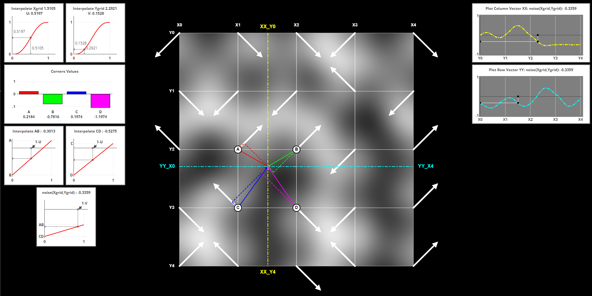

# PERLIN NOISE DEMO

## [LINK TO DEMO ...](https://geniosainz.github.io/Perlin-Noise-Demo/)
This demo shows graphically how Ken Perlin's [Improved Noise Algorithm](chrome-extension://efaidnbmnnnibpcajpcglclefindmkaj/https://mrl.cs.nyu.edu/~perlin/paper445.pdf) from 2002 works. This algorithm also known as Perlin Noise is an improvement of the original 1984 version. Perlin Noise is often used in the generation of procedural content, such as terrain, fluid flow, textures... Combined with fractal Brownian motion (FBM) I will use it to generate 2D procedural terrain to create controlled scenarios for the study of power line routing. 

The demo shows how from an input point on the 2D grid 4 parameters are obtained by means of the dot product between:
- The pseudo-random vectors at the corners of each cell.  These vectors are defined by the seed of the algorithm.
- The vectors defined by the entry point and the corners of each cell.

By interpolating these parameters, the output of the algorithm is finally obtained.These two references explain this topic in detail. By [Raouf Touti](https://rtouti.github.io/graphics/perlin-noise-algorithm) and
[Adrian Biagioli](https://adrianb.io/2014/08/09/perlinnoise.html).

 

