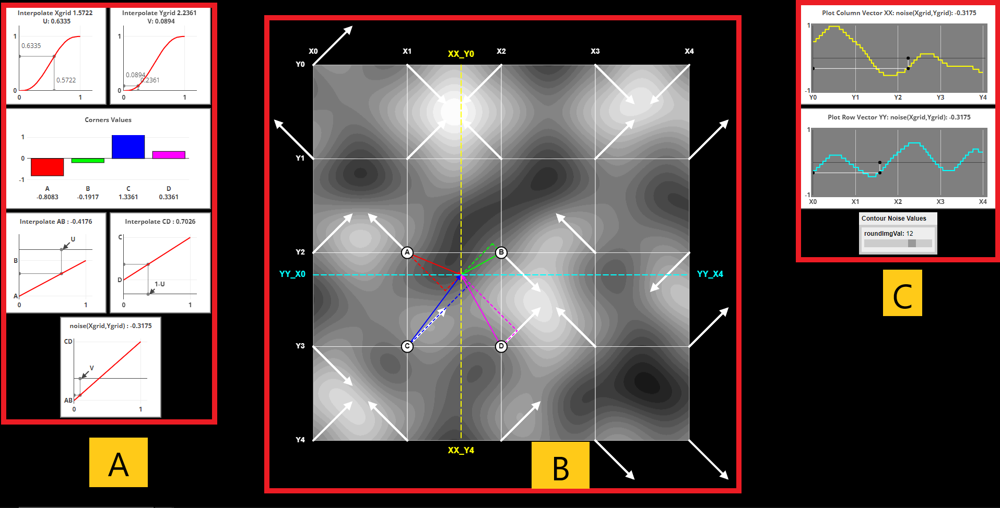
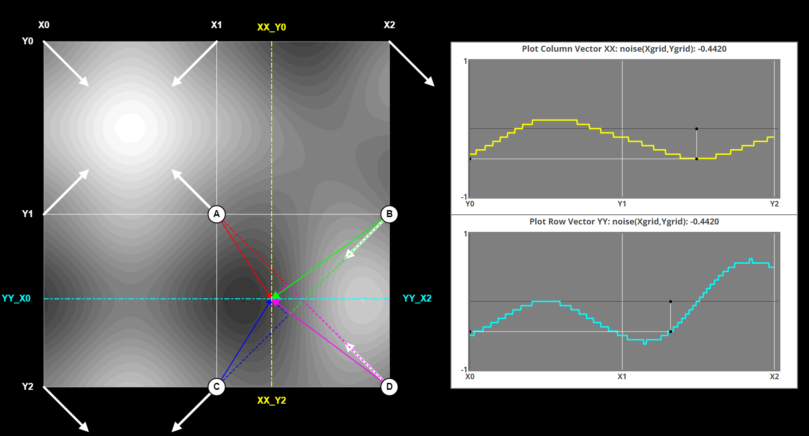
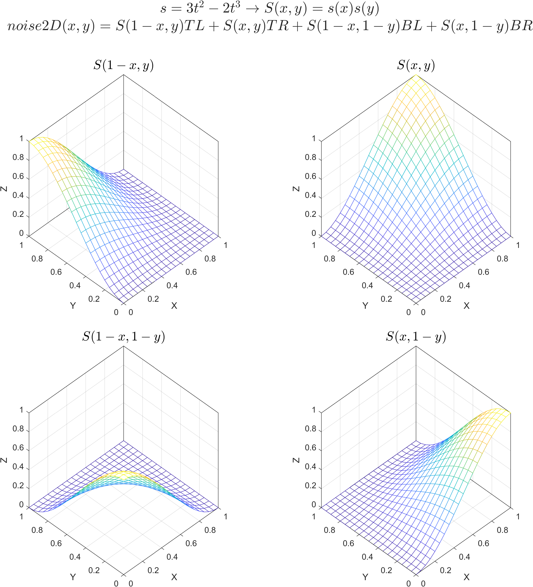
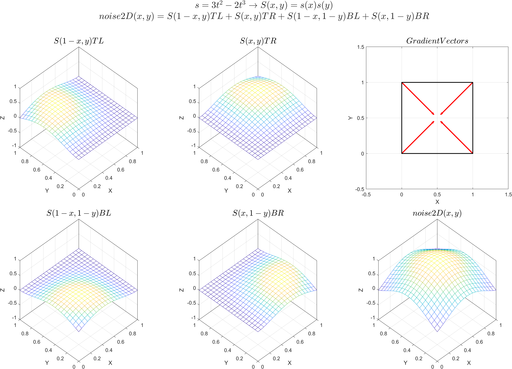
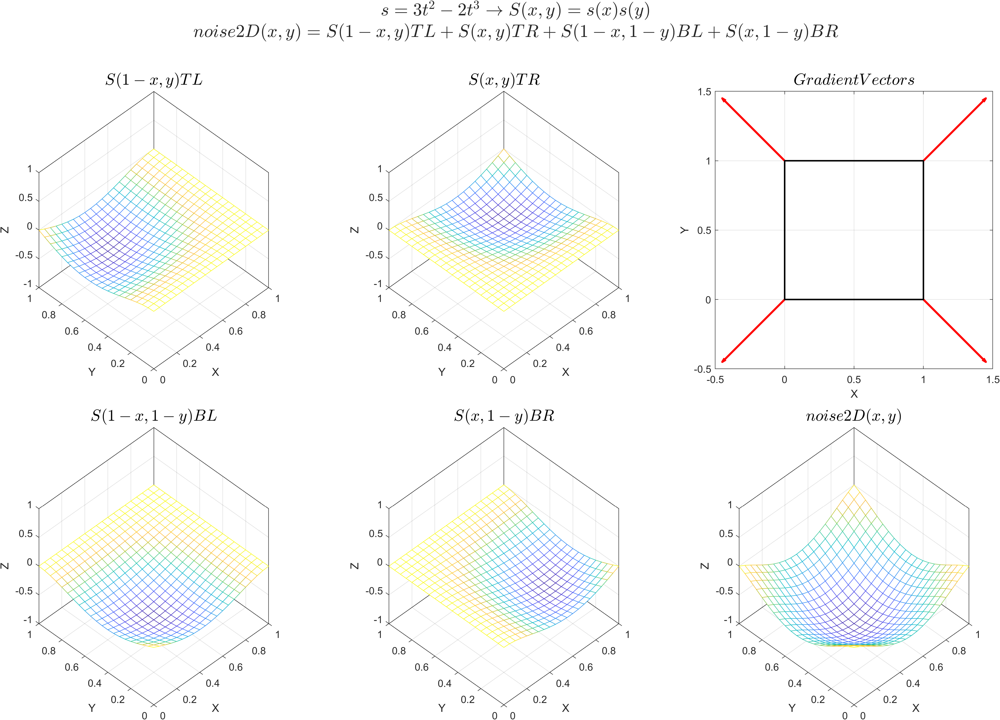
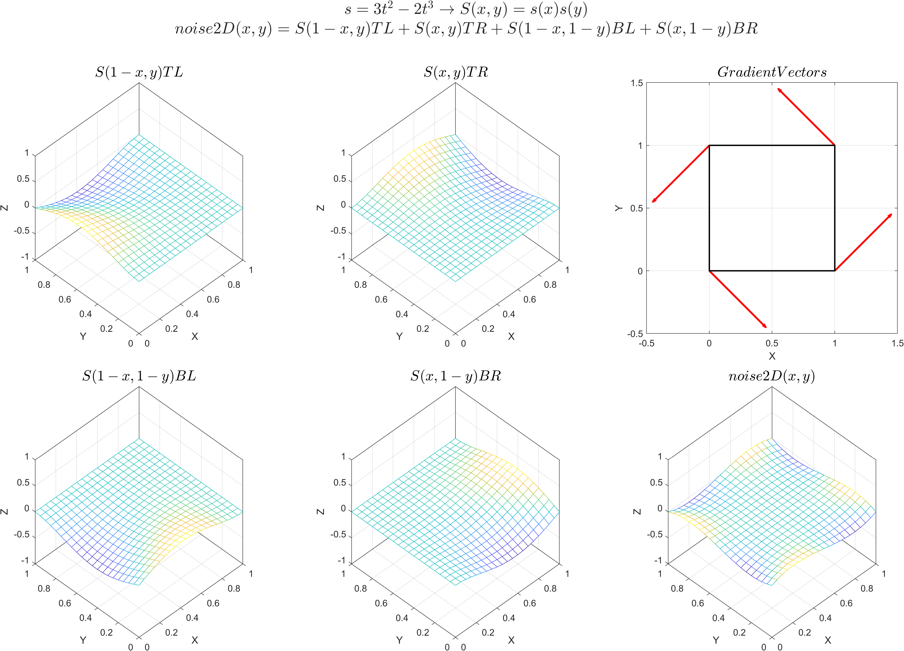
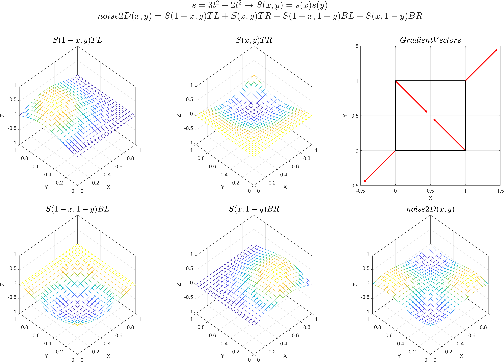

# PERLIN NOISE DEMO

## [LINK TO DEMO ...](https://geniosainz.github.io/Perlin-Noise-Demo/)
This JavaScript based demo shows graphically how Ken Perlin's [Improved Noise Algorithm](chrome-extension://efaidnbmnnnibpcajpcglclefindmkaj/https://mrl.cs.nyu.edu/~perlin/paper445.pdf) from 2002 works. This algorithm also known as Perlin Noise is an improvement of the original 1984 version. Perlin Noise is often used in the generation of procedural content, such as terrain, fluid flow, textures... These two references explain this algorithm in detail, by [Raouf Touti](https://rtouti.github.io/graphics/perlin-noise-algorithm) and
[Adrian Biagioli](https://adrianb.io/2014/08/09/perlinnoise.html).
Combined with fractal Brownian motion (FBM), I will use it to generate 2D procedural terrain to create controlled scenarios for the study of power lines routing. 

I have used as main library [P5.js](https://p5js.org/) for the representation of all the elements that involve the main grid and [Plotly.js](https://plotly.com/javascript/) for the creation of the dynamic graphics.

## DEMO FEATURES

The demo shows how from an input point on the 2D grid 4 parameters are obtained by means of the dot product between:
- Gradient vectors at the corners of each cell.  These vectors are defined by the seed of the algorithm.
- The vectors defined by the entry point and the corners of each cell.

By interpolating these parameters, the output of the algorithm is finally obtained.

<ul>
  <li><b>A:</b> Interpolations

  <ul>
    <li> Smoothstep interpolations: <i> U = Smoothstep( Xgrid ), V = Smoothstep( Ygrid ) </i></li>
    <li> Corners values graph:      <i> A,B,C,D                                          </i></li>
    <li> Lerp interpolations:       <i> AB = Lerp(U,A,B), CD = Lerp(U,C,D)               </i></li>
    <li> Algorithm Output:          <i> Z = noise2D(Xgrid,Ygrid) = Lerp(V,AB,CD)         </i></li>
  </ul>

  </li>

  <li><b>B:</b> Input grid representing...
    <ul>
        <li> The gradient vectors of each corner</li>
        <li> The color map generated from the evaluation of the noise2D function for each pixel of the image</li>
        <li> Input vectors defined by the entry point (xGrid,yGrid), and the projections of these vectors onto the gradient vectors.  The value of A, B, C, D is proportional to the magnitude of the projections </li>
    </ul>
  </li>

  <li><b>C:</b> 1D Noise slices traces of the 2D noise by plotting the row/column YY/XX vectors defined by the input (x,y) coordinates.

  </li>

</ul>

Zoom over 1D Noise.

## NOISE INTERPOLATIONS

